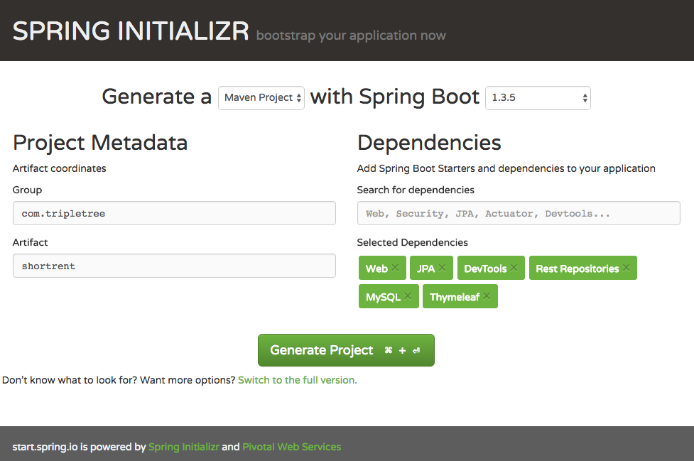

# Short Rent Web Application

## What's this app
This is our first version of short rent web app like [airbnb](https://zh.airbnb.com/)

## Main features
- [Spring Boot](http://projects.spring.io/spring-boot/) framework
- [Spring Data JPA](http://projects.spring.io/spring-data-jpa/) for JPA based repositories
- [Thymeleaf](http://www.thymeleaf.org/) for server-side Java template engine

## How to run it
- Clone the code
    `git clone https://github.com/triple-tree/shortrent.git`
- Install client libs
	`bower install && bower-installer`
- Run in terminal
    `mvn spring-boot:run`
- Import in Intellij idea or eclipse and run `ShortrentApplication` as ordinary java application

## How we design it
- Use spring-boot to construct the project
	We use [start.spring.io](http://start.spring.io/) to create the initial project skeleton
    
- Use [maven](maven.apache.org) instead of gradle to manage project dependencies and provide some useful plugin script
- Use [bower](http://bower.io/) to manage project client(front-end) libs, we install these libs into the default bower_components sub-directory under spring's static folder `/src/main/resources/static` (see .bowerrc) and install to a general location using [bower-installer](https://www.npmjs.com/package/bower-installer) (see install section in bower.json, need a new version see https://github.com/blittle/bower-installer/issues/139)

## What we need do
- [x] create initial project
- [x] add basic configuration
- [x] add some fundamental functionalites
- [x] add [Swagger](http://swagger.io/) api documentation via [swagger-springmvc](https://github.com/rlogiacco/swagger-springmvc)
- [ ] ... and so on

## Other resources
- [Spring Boot Reference Guide](http://docs.spring.io/spring-boot/docs/current/reference/htmlsingle/)
- [Installing the Spring Boot CLI](http://docs.spring.io/spring-boot/docs/current/reference/htmlsingle/#getting-started-installing-the-cli)
- [Spring MVC: from JSP and Tiles to Thymeleaf](http://spring.io/blog/2012/10/30/spring-mvc-from-jsp-and-tiles-to-thymeleaf/)
- [Mastering Markdown](https://guides.github.com/features/mastering-markdown/)
- [Thymeleaf Page Layouts](http://www.thymeleaf.org/doc/articles/layouts.html)
